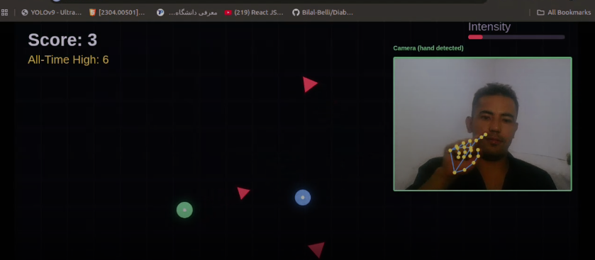

# 🎮 Neon Dodge — Finger Tracker Edition

A browser-based arcade game controlled entirely by your **index finger**, tracked live through your webcam. No mouse, no keyboard, no installs — just open the page and play.

Built with **HTML5 Canvas**, **MediaPipe Hands**, and vanilla JavaScript. Runs in any modern browser.

---

## 🎥 Demo

https://github.com/user-attachments/assets/cbdce3bd-e702-4e8e-8964-5e0947bd27eb


> **Note:** If the video doesn't play directly above, [click here to watch the gameplay demo](assets/gameplay-demo.mp4).

<p align="center">
  
</p>

---

## ✨ Features

- **Real-time finger tracking** via [MediaPipe Hands](https://github.com/google/mediapipe) — no calibration needed, just show your hand to the camera
- **Neon glow visuals** rendered on HTML5 Canvas with layered glow effects
- **Progressive difficulty** — enemy speed and spawn rate scale up as your score climbs, becoming intensely difficult around a score of 20
- **Persistent high score**, saved locally in your browser
- **Gesture-based restart** — hold an open palm still for 2 seconds to play again, no keyboard required
- **Live camera preview** with hand-skeleton overlay, so players can see exactly what the game is tracking
- **Zero installation** — MediaPipe loads from a CDN at runtime; just serve the HTML file and open it in a browser

---

## 🕹️ How to Play

| Action | How |
|---|---|
| Move the player | Move your **index finger** in front of the webcam |
| Collect points | Touch the glowing **green orbs** |
| Avoid | Glowing **red enemies** — touching one ends the game |
| Restart after Game Over | Hold an **open palm** still for 2 seconds, or press `SPACE` / `R` |
| Quit | Press `ESC` or `Q` |

---

## 🚀 Getting Started

Because browsers block webcam access on `file://` pages, you need to serve this over a local (or hosted) web server.

### Option 1 — Run locally with Python

```bash
git clone https://github.com/<your-username>/<your-repo>.git
cd <your-repo>
python3 -m http.server 8000
```

Then open **http://localhost:8000** in Chrome or Edge, and click **"Enable Camera & Start."**

### Option 2 — Host with GitHub Pages

1. Push this repo to GitHub.
2. Go to **Settings → Pages**, and set the source to your default branch (`main`).
3. Once published, open the generated `https://<your-username>.github.io/<your-repo>/` URL in Chrome.

No build step, no dependencies to install — it's a single static HTML file.

---

## 🛠️ Tech Stack

- **HTML5 Canvas** — all rendering (player, orbs, enemies, glow effects, UI)
- **[MediaPipe Hands](https://developers.google.com/mediapipe)** (loaded via CDN) — real-time hand landmark detection
- **Vanilla JavaScript** — game loop, physics, difficulty scaling, state management
- **Web Audio API** — synthesized pickup sound effects (no external audio files)
- **`localStorage`** — persists your all-time high score between sessions

---

## 📁 Project Structure

```
.
├── index.html              # The entire game — HTML, CSS, and JS in one file
├── README.md
└── assets/
    ├── gameplay-demo.mp4   # Gameplay demo video
    └── Screenshot.png      # Gameplay screenshot
```

---

## 🌐 Browser Requirements

- Google Chrome or Microsoft Edge (recommended)
- A working webcam
- Internet connection on first load (to fetch MediaPipe from its CDN — cached by the browser afterward)

---

## 📄 License

This project is available under the [MIT License](LICENSE). Feel free to fork, modify, and build on it.

---

## 🙏 Acknowledgments

- [MediaPipe](https://github.com/google/mediapipe) by Google, for real-time hand tracking
- Built for a technology exhibition demo — designed to be approachable, visually punchy, and fun to watch from a distance
